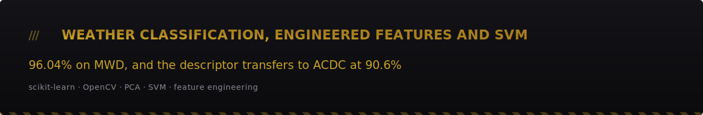
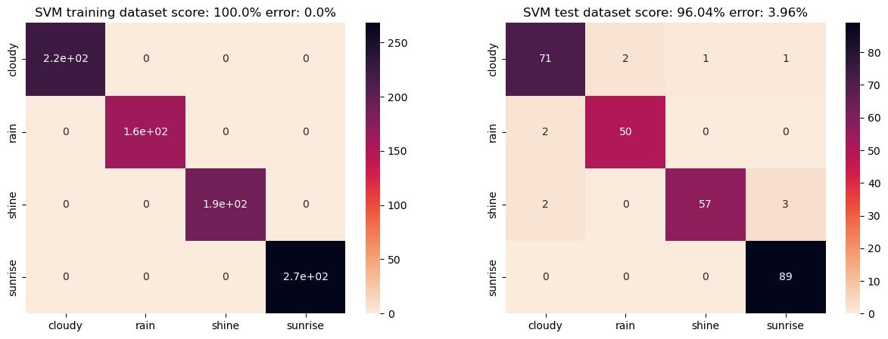
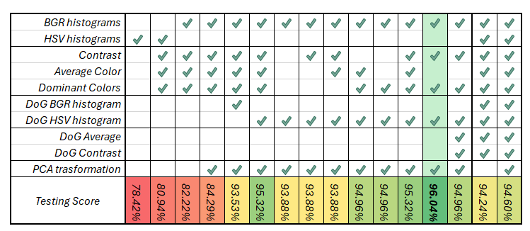
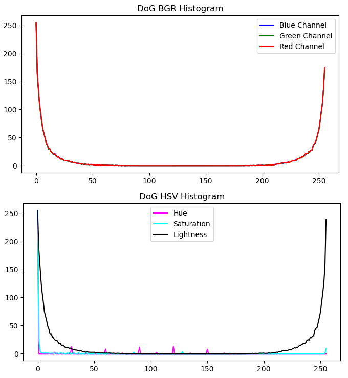
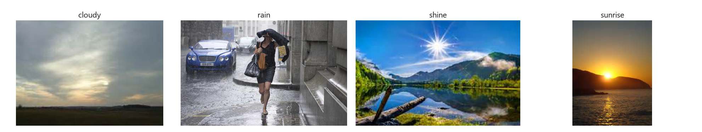
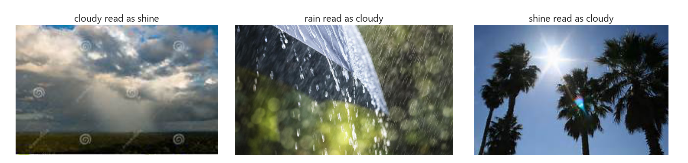
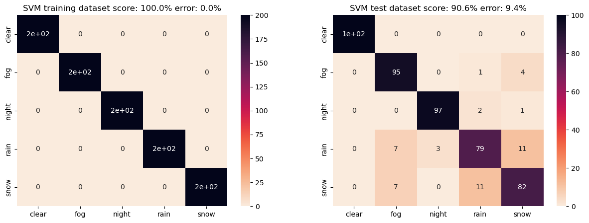
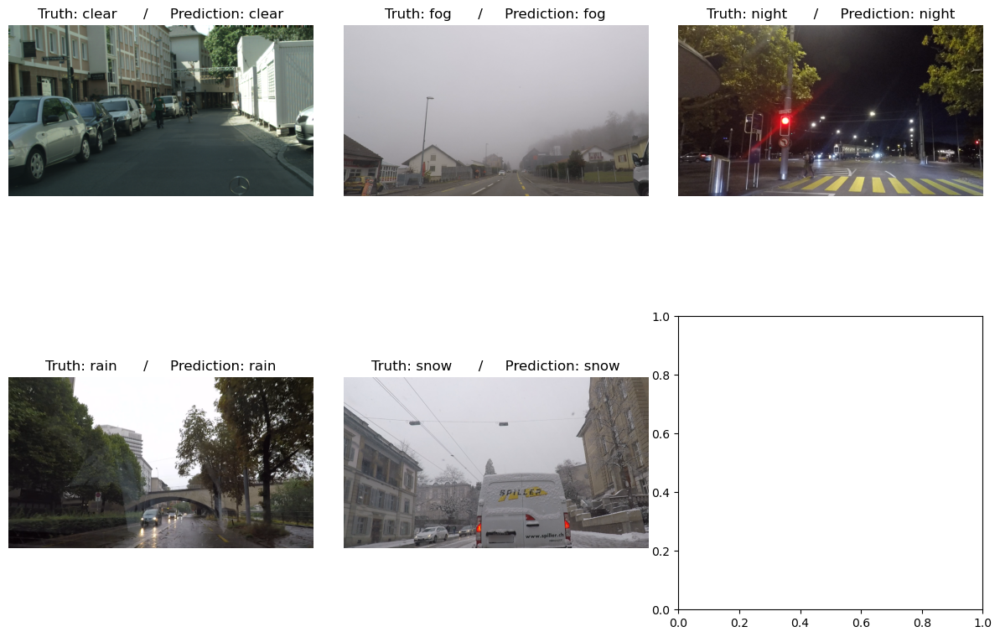
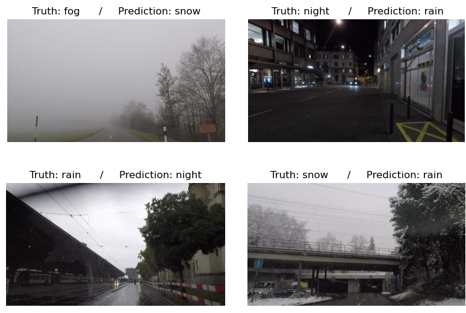

> **96.04% test accuracy on the Multi-class Weather Dataset from hand-engineered colour and edge features fed to an SVM, with no deep learning anywhere in the pipeline. The fitted PCA and SVC ship in `models/`, so the result is loadable, not just reported.**


[](report/report.pdf)



*The shipped model on MWD: 100% on the 845 training images, 96.04% on the 278 test images. Sunrise is classified perfectly, 89 out of 89.*

## Abstract

A single still image is assigned one of four weather conditions (cloudy, rain, shine, sunrise) using a 1562-dimensional descriptor built by hand from BGR histograms, per-channel contrast, k-means dominant colours, and the HSV histograms of a Difference-of-Gaussian version of the image. PCA reduces the descriptor to 200 components, and a grid-searched SVC does the classification. On the Multi-class Weather Dataset (MWD) the model reaches 96.04% on the held-out test split, 267 correct out of 278. The same feature design, with the classifier refit on that dataset's own training split, reaches 90.6% on ACDC, a five-class driving dataset shot in adverse conditions. The fitted PCA and SVC are serialised in `models/`.

## Problem

Weather has no shape. There is no object to localise and no bounding box to regress, and a rainy street contains the same buildings, the same road and the same sky as a cloudy one. The classes differ only in the statistics of the light, so the design question is which measurable image property separates them.

For the four MWD classes, colour is a plausible answer. Sunrise is warm and low-saturation-blue. Shine has a saturated blue sky and high contrast. Cloudy collapses into a narrow band of grey. A global colour histogram should therefore carry most of the discriminative signal, and the results below say it does.

That answer is fragile in a specific way. It works because the MWD classes happen to differ in colour. Rain is already the hard class inside MWD, since a rainy scene with no visible precipitation streaks has, statistically, a cloudy histogram. Push the same idea onto classes that do not differ in colour, and it has nothing left to measure. The ACDC experiment is there to price that failure.

## Motivation

Two things made this worth building.

First, a 200-component descriptor and an off-the-shelf SVM get to 96% on a task that people routinely reach for a CNN to solve. Knowing where the classical floor sits is useful before committing a GPU budget, and feature extraction over the whole MWD training split takes 53.75 seconds on a CPU.

Second, feature selection was run against the test split. Every candidate feature was added, the model refit, the test score written down, and the feature kept or dropped on that number. A score obtained that way is contaminated, and reporting it alone would say nothing about whether the features mean anything outside this dataset. So the descriptor was carried to ACDC, unchanged, and re-evaluated there. That transfer is the honest part of the project, and it is what the Discussion section is about.

## Approach

**The feature selection loop.** The descriptor was assembled one candidate at a time. Add a feature, refit PCA and the SVM, record the test score, keep the change if the score rose. Both of my a priori assumptions turned out to be wrong.

I began with HSV histograms, expecting a perceptual colour space to carry more usable signal than raw sensor channels. Swapping HSV for BGR moved the score from 78.42% to 82.22%. On the Difference-of-Gaussian image the opposite holds, because the three BGR channels of a DoG image are nearly coincident, so a BGR histogram triples one signal and adds no new information, while HSV separates that shared component into the value channel and exposes hue and saturation structure. Switching the DoG term from BGR to HSV added about two more points.

Adding more features made the model worse. Average colour, dropped on top of histograms and dominant colours, lowered the score, and so did DoG average, DoG contrast, and the control run with every extractable feature at once. Removing average colour while keeping contrast and dominant colours produced the best configuration.



*Each column is one iteration of the loop. The kept configuration is the highlighted one.*



*Why HSV wins on the DoG image: the three BGR curves are almost coincident and duplicate the HSV value channel, while hue and saturation carry structure that BGR does not represent.*

**The retained descriptor.** Every component is z-normalised before concatenation.

| Component | Dimensions |
|---|---|
| BGR histograms (3 channels x 256 bins) | 768 |
| Contrast (per-channel mean and standard deviation) | 6 |
| Dominant colours (6 k-means centroids, RGB) | 18 |
| DoG HSV histograms (3 channels x 256 bins) | 768 |
| Array initialisation padding (constant) | 2 |
| **Total** | **1562** |
| **After PCA** | **200** |

The Difference of Gaussian is computed on the colour image rather than a greyscale one, because greyscaling would throw away exactly the information the rest of the pipeline runs on. Dominant colours come from k-means with k = 6 on a 100x100 nearest-neighbour downsample, which is what makes the extraction affordable across the dataset (53.75 seconds for the 845 training images).

```python
def get_picture_color_features(picture):
    b, g, r = calculate_picture_histograms(picture)          # 3 x 256, z-normalised
    contrast = get_picture_Contrast(picture)                 # 6
    _, dominant_colors, _ = get_averageAndDominantColors(picture)
    dominant_colors = get_zNormalized_vector(dominant_colors)  # 6 x 3

    DoG = Difference_Of_Gaussian(picture)
    dog_h, dog_s, dog_v = calculate_HSV_histograms(DoG)      # 3 x 256

    features_elements = [b, g, r,
                         contrast, dominant_colors,
                         dog_h, dog_s, dog_v]

    features = np.float32((0, 0))                            # the 2 padding dimensions
    for element in features_elements:
        element = np.array(element, dtype="float32").flatten()
        features = np.concatenate((features, element), axis=0)
    return features                                          # (1562,)
```

**Classifier.** PCA to 200 components, then `GridSearchCV` over an SVC with C in {0.01, 0.1, 1, 10, 100}, gamma in {0.001, 0.1, 1}, and kernel in {linear, rbf, poly}. The shipped model selected an RBF kernel with C = 10 and gamma = 0.001.

**Data.** MWD holds 1125 images in four classes, of which two training images cannot be decoded by OpenCV's `imread` and are skipped, leaving 845 training and 278 test images. ACDC supplies 1000 training and 500 test images across five classes, balanced at 100 test images per class.

## Results

| Dataset | Classes | Train | Test | Train acc | Test acc |
|---|---|---|---|---|---|
| MWD | 4 (cloudy, rain, shine, sunrise) | 845 | 278 | 100% | **96.04%** |
| ACDC | 5 (clear, fog, night, rain, snow) | 1000 | 500 | 100% | **90.6%** |

**MWD: 267 correct out of 278.** Eleven errors. Four are cloudy against rain in both directions, five involve shine, and the sunrise row of the confusion matrix is 89 correct and 0 wrong. The model never misses a sunrise. The errors that remain fall exactly where the colour overlap predicts they would.



*One correctly classified test image per MWD class.*



*The MWD error modes. There is no sunrise panel here because there are no sunrise errors to show: sunrise is classified perfectly, 89 out of 89.*

**ACDC: 453 correct out of 500.** Per-class accuracy is clear 100%, night 97%, fog 95%, snow 82%, rain 79%. The clear row of the ACDC confusion matrix is 100 correct and 0 wrong, so that class, like sunrise on MWD, is never missed. All of the loss sits in the three classes that a colour histogram cannot pull apart. Rain and snow confuse each other 22 times out of 200, and they leak into fog 14 more times. Under an overcast sky, a rainy road, a snowy road and a foggy road have nearly the same global colour distribution.



*ACDC. Clear and night are essentially solved. The 9.4 points of error are almost entirely rain against snow against fog.*



*One correctly classified test image per ACDC class.*



*The ACDC error modes: fog read as snow, night read as rain, rain read as night, snow read as rain. There is no clear panel, because the model made zero errors on clear.*

**Run-to-run variance.** The 96.04% belongs to the serialised model in `models/`. A clean refit of the notebook lands around 94.6%, because the dominant colour extraction calls `cv.kmeans` with `KMEANS_RANDOM_CENTERS` and no seed. 18 of the 1562 descriptor dimensions are therefore stochastic, and they move the fitted decision boundary between runs. The gap is a property of the pipeline, and it is described in Limitations rather than smoothed over.

## Discussion

The ACDC number needs a precise reading, because the obvious reading is wrong.

ACDC has a different class set from MWD: clear, fog, night, rain, snow, against MWD's cloudy, rain, shine, sunrise. The MWD classifier cannot be scored on ACDC images at all, since three of the five labels do not exist in its output space. So the PCA and the SVC were **refit from scratch on ACDC's own training split**, and only the feature design carried over. Calling that "generalisation without retraining" would be a lie about what happened.

What the 90.6% does measure is the worth of a feature set designed on one dataset when it is applied to another. The descriptor was tuned, iteration by iteration, against MWD's test split, on four classes photographed by many different cameras in many different places. ACDC is dashcam footage from a single vehicle in Switzerland, five classes, none of which the descriptor was designed to separate. Dropping that descriptor into the new problem, with no new features and no redesign, still supports 90.6%, and the per-class breakdown says exactly where the design is load-bearing and where it runs out.

It runs out precisely where colour stops discriminating. Clear and night are free, because global lightness separates them from everything else and from each other. Fog holds up at 95%, because a fog histogram is genuinely distinctive: everything collapses towards a single grey mode. Rain and snow are where the design fails, and it fails for a reason that is visible in the descriptor itself. A global histogram discards spatial location, and the whole difference between a rainy road and a snowy road is on the ground, under a sky that looks the same in both. Averaging the image into one histogram destroys that distinction before the classifier ever sees it.

The obvious next step follows from that sentence. Segment ground from sky, run the same colour analysis per region, and the rain against snow distinction becomes available. Snow ground is white and rain ground is not.

## Limitations

**The features are colour-specialised by construction.** Everything in the descriptor, except the six contrast numbers, is some form of colour distribution. Any two weather classes that share a colour distribution are invisible to it, which is what the ACDC rain and snow rows show. A greyscale weather dataset would reduce this pipeline to close to chance.

**The pipeline is non-deterministic.** The dominant-colour k-means is unseeded, so the 18 dominant-colour dimensions differ between runs on the same image. The shipped model scores 96.04%; a fresh refit of the notebook scores about 94.6%. Fixing this needs one seed and a re-run, and until then the reported number should not be treated as exactly reproducible.

**Feature selection used the test split.** Each candidate feature was accepted or rejected on the MWD test score. That score is therefore optimistic as an estimate of performance on unseen MWD-like data, and the ACDC experiment exists because of it.

**The datasets are not in this repository.** MWD is roughly 96 MB and ACDC is larger, so both are linked rather than vendored. Retraining requires downloading them. The shipped `.pkl` files exist to make inference possible without that.

**Global histograms throw away location.** Stated above, repeated here because it is the single structural limit of the design and the thing that would need to change first.

## Reproduce

**The fitted models ship with the repository.** `models/pca_weatherClassification.pkl` and `models/svc_weatherClassification.pkl` are the exact PCA and grid-searched SVC behind the 96.04% number. You can classify an image with them right now: no 96 MB dataset download, no refit, no grid search.

```bash
pip install -r requirements.txt
```

The snippet below is the feature extraction pipeline the shipped model expects, transcribed from `notebooks/FinalProject.ipynb`. It takes a BGR image as returned by `cv.imread` and produces the 1562-dimensional descriptor that the shipped PCA was fitted on.

```python
import cv2 as cv
import numpy as np
import joblib

pca = joblib.load("models/pca_weatherClassification.pkl")
svc = joblib.load("models/svc_weatherClassification.pkl")

def znorm(v):
    v = np.asarray(v, dtype="float32")
    std = v.std()
    return (v - v.mean()) / std if std != 0 else v

def histograms(img, hsv=False):
    if hsv:
        img = cv.cvtColor(img, cv.COLOR_BGR2HSV)
    planes = cv.split(img)
    return [znorm(cv.calcHist(planes, [i], None, [256], (0, 256))) for i in range(3)]

def features(img):
    bgr = histograms(img)                                    # 3 x 256
    contrast = znorm(cv.meanStdDev(img))                     # 6
    small = cv.resize(cv.cvtColor(img, cv.COLOR_BGR2RGB), (100, 100),
                      interpolation=cv.INTER_NEAREST)
    pixels = np.float32(small.reshape(-1, 3))
    criteria = (cv.TERM_CRITERIA_EPS + cv.TERM_CRITERIA_MAX_ITER, 200, .1)
    _, labels, centers = cv.kmeans(pixels, 6, None, criteria, 10, cv.KMEANS_RANDOM_CENTERS)
    _, counts = np.unique(labels, return_counts=True)
    dominant = znorm(centers[np.argsort(counts)[::-1]])      # 6 x 3
    dog = cv.GaussianBlur(img, (1, 1), 0) - cv.GaussianBlur(img, (3, 3), 0)
    dog_hsv = histograms(dog, hsv=True)                      # 3 x 256

    out = np.float32((0, 0))                                 # padding, as in the notebook
    for part in bgr + [contrast, dominant] + dog_hsv:
        out = np.concatenate((out, np.array(part, dtype="float32").flatten()))
    return out                                               # (1562,)

image = cv.imread("your_image.jpg")
print(svc.predict(pca.transform([features(image)]))[0])      # cloudy | rain | shine | sunrise
```

**The scikit-learn pin is load-bearing.** Both `.pkl` files were serialised with scikit-learn 1.3.2, and that is what `requirements.txt` pins. A newer scikit-learn will still unpickle them, but it raises `InconsistentVersionWarning` and gives no guarantee that the loaded estimator behaves as it did when it was fitted. Install the pinned version if you want the 96.04% model to be the model you are actually running.

**To retrain.** `notebooks/FinalProject.ipynb` runs the whole thing end to end, with its saved outputs intact. It expects the dataset in an `MWD/` folder next to the notebook, split into `train/` and `test/` subfolders by class. Setting `use_pre_storedSVCPCA = 1` in section 1.3 makes the notebook load the shipped `.pkl` files instead of refitting and re-running the grid search. Remember that a refit will not land on 96.04% exactly, for the unseeded k-means reason given above.

- MWD: [Mendeley Data, doi:10.17632/4drtyfjtfy.1](https://doi.org/10.17632/4drtyfjtfy.1)
- ACDC: [acdc.vision.ee.ethz.ch](https://acdc.vision.ee.ethz.ch/)

## Report, data and citation

The full write-up, with the feature engineering loop, the confusion matrices, the cross-dataset analysis and the reference list: [`report/report.pdf`](report/report.pdf).

**Data.** The Multi-class Weather Dataset is on [Mendeley Data](https://doi.org/10.17632/4drtyfjtfy.1). ACDC, the Adverse Conditions Dataset with Correspondences, is at [acdc.vision.ee.ethz.ch](https://acdc.vision.ee.ethz.ch/). Neither is redistributed here.

**License.** MIT. See [`LICENSE`](LICENSE).

**Citation.**

```bibtex
@software{mihailescu_weather_svm,
  author = {Alexandru Mihailescu},
  title  = {Weather Image Classification with Engineered Features and SVM},
  url    = {https://github.com/artaeun/weather-classification-svm},
  note   = {96.04\% test accuracy on the Multi-class Weather Dataset}
}

@misc{ajayi2018mwd,
  author       = {Gbeminiyi Ajayi},
  title        = {Multi-class Weather Dataset for Image Classification},
  howpublished = {Mendeley Data, V1, \url{https://doi.org/10.17632/4drtyfjtfy.1}},
  year         = {2018}
}

@inproceedings{sakaridis2021acdc,
  author    = {Christos Sakaridis and Dengxin Dai and Luc Van Gool},
  title     = {{ACDC}: The Adverse Conditions Dataset with Correspondences for Semantic Driving Scene Understanding},
  booktitle = {IEEE/CVF International Conference on Computer Vision (ICCV)},
  year      = {2021}
}

@article{cortes1995svm,
  author  = {Corinna Cortes and Vladimir Vapnik},
  title   = {Support-Vector Networks},
  journal = {Machine Learning},
  volume  = {20},
  number  = {3},
  pages   = {273--297},
  year    = {1995}
}
```
